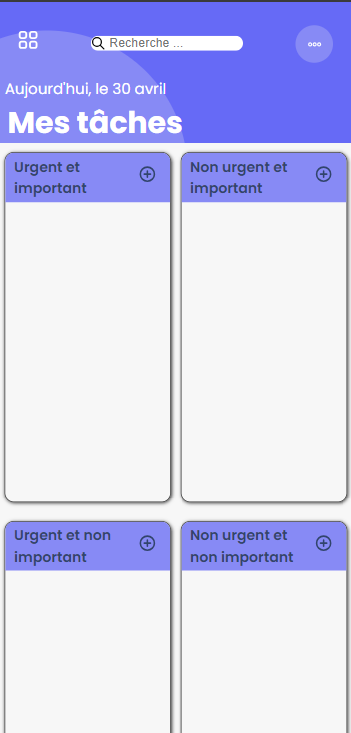

# todoList

## Introduction

Le but de cet exercice était de créer une todo List qui résumait les différents points qu'on avait abordé précédement : 
- HTML/SCSS
- BEM
- Responsive/mobile first
- JS
- DOM
- EventListener

## Mon projet

Mon projet était de partir sur une todo basé sur la matrice d'Eisenhower.
Je me suis basé sur un design trouvé sur Behance.

Plutôt content du résultat graphique.

J'ai cependant éprouvé beaucoup de difficulté concernant le localStorage. En effet, cela était nouveau pour moi et je voulais aborder ce sujet à la toute fin de projet. Mais j'ai du réadapter toutes mes fonctions et cela m'a pris un temps de dingue.

## Les objectifs : 

Les objectifs étaient de pouvoir ajouter, checked, supprimer une tâche. Nous devions également la stocker dans le localStorage et le mettre à jour en conséquence.

Voici ou j'en suis arrivé : 
- Toutes les fonctionnalités en dehors du localStorage fonctionnent bien.
- J'arrive à ajouter au localStorage mes tasks, à les supprimer, à les faire réafficher au chargement de ma page. Cependant lorsque ma page a été raffraichie, et que je souhaite supprimer une tâche cela ne fonctionne plus.
- Je n'ai pas eu le temps de m'occuper de la fonctionnalité checked dans le localStorage, mais j'ai l'idée en tête. Il est nécessaire que j'ajoute une propriété 'checked: false' à mes objets et que je mette a jour lorsque je checked mais pas eu le temps.

## Conclusion : 

Très chouette projet à réaliser, on sent qu'on commence a rentrer dans le vif du sujet et qu'il va falloir s'accrocher. J'ai, a mon avis trop chercher à me compliquer avec le design. Mais j'ai pris du plaisir a le réaliser. 